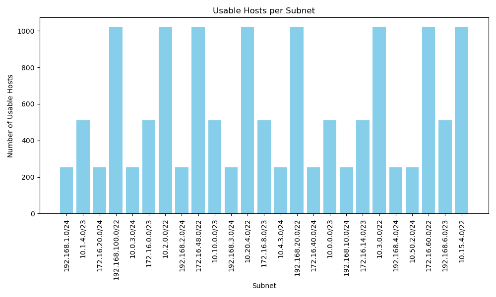
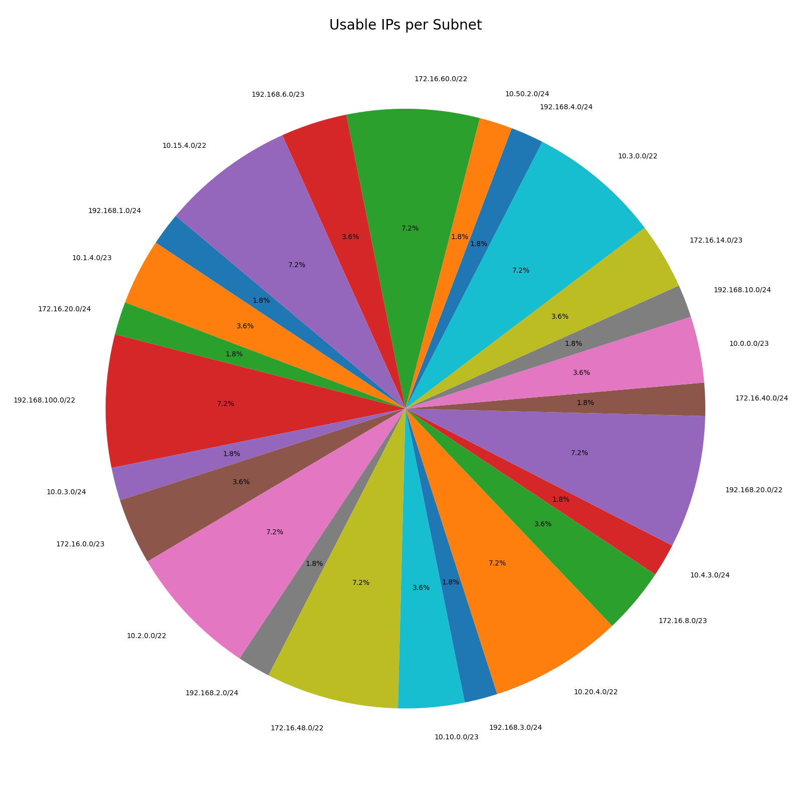

# Barq-DevOps-Subnet-Task

## Task Overview

It's a Python-based tool for analyzing and visualizing IP subnet data, The tool reads an Excel file of IP addresses and subnet masks, calculates key network information, and generates both a JSON report and visualizations.

---

## Features
- Reads IP and subnet data from an Excel file (`ip_data.xlsx`)
- Calculates CIDR, network address, broadcast address, and usable hosts
- Outputs a detailed JSON report (`subnet_report.json`)
- Generates bar and pie charts visualizing usable hosts per subnet

---

## Project Structure
```
.
├── Dockerfile
├── requirements.txt
├── subnet_analyzer.py   # Main analysis script
├── visualize.py         # Visualization script
├── ip_data.xlsx         # Input data 
├── subnet_report.json   # Output: network info 
├── network_plot.png     # Output: bar chart
├── network_pie_chart.png# Output: pie chart 
└── README.md
```

---

## Input
- **ip_data.xlsx**: Excel file with columns:
  - `IP Address`
  - `Subnet Mask`

## Output
- **network information** : like CIDR , Network , Broadcast Addresses , Usable hosts per subnet
- **subnet_report.json**: JSON file with calculated network information
- **network_plot.png**: Bar chart of usable hosts per subnet
- **network_pie_chart.png**: Pie chart of usable hosts per subnet

---

## Requirements
- Python 3.10+
- pip

---

## Getting Started

### 1. Clone the repository
```bash
git clone <your-repo-url>
cd Barq-System
```

### 2. Place your `ip_data.xlsx` file in the project root directory.

### 3. Install dependencies
```bash
pip install -r requirements.txt
```

### 4. Run the main analysis script
```bash
python subnet_analyzer.py
```

### 5. Run the visualization script
```bash
python visualize.py
```
- Regenerates visualizations from the JSON report.

---

## Running with Docker

### 1. Build the Docker image
```bash
docker build -t barq-task .
```

### 2. Run the Docker container
```bash
docker run -v $(pwd):/app barq-task
```

---

## Example

**Sample `ip_data.xlsx`:**

| IP Address   | Subnet Mask     |
|--------------|-----------------|
| 192.168.1.24 | 255.255.255.0   |
| 10.1.5.4     | 255.255.254.0   |

**Sample Output (`subnet_report.json`):**
```json
[
  {
    "IP Address": "192.168.1.24",
    "Subnet Mask": "255.255.255.0",
    "CIDR": 24,
    "Network Address": "192.168.1.0",
    "Broadcast Address": "192.168.1.255",
    "Usable Hosts": 254
  }
]
```

---

## Example Output Charts

Below are examples of the generated charts:

### Bar Chart


### Pie Chart


---

Thank you for reviewing the task!  
Best regards,   
ِAbdeltawab
